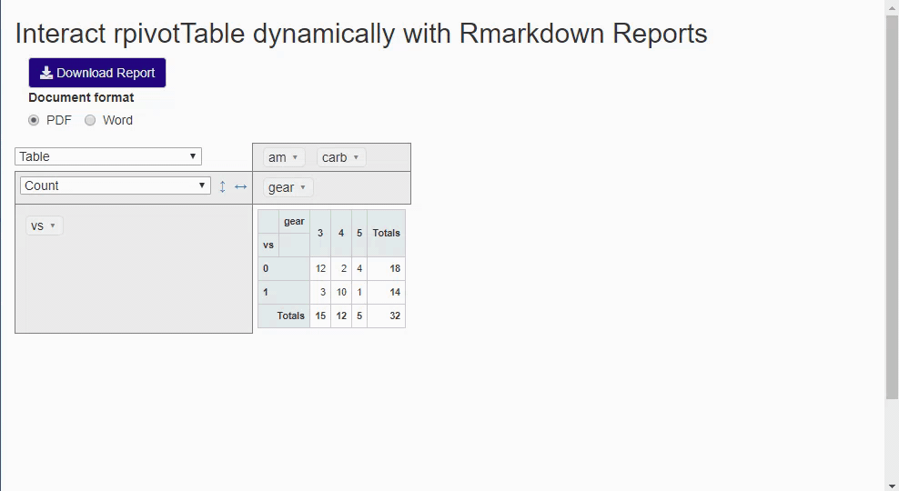

# rpivotTableMD

This is shiny app demonstrate `rpivotTable` dynamically interacting with Rmarkdown reports (pdf or word) in a shiny app platform! 

Check it out! Live app (limited to 30 active hours): https://jienagu-awesome-data-scientist.shinyapps.io/rpivottable_MD/ 

## Acknowledgement
Beef Cattle Institute at Kansas State University: https://ksubci.org/ 

Special thanks to Yihui Xie (from RStudio.LLC), and @timelyportfolio 

